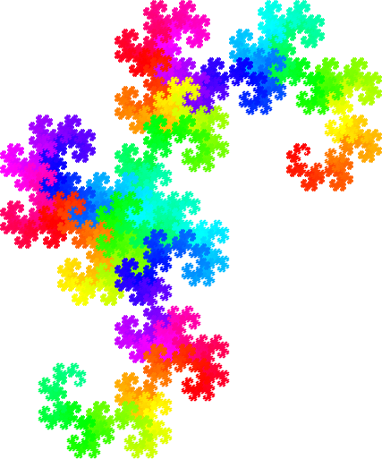
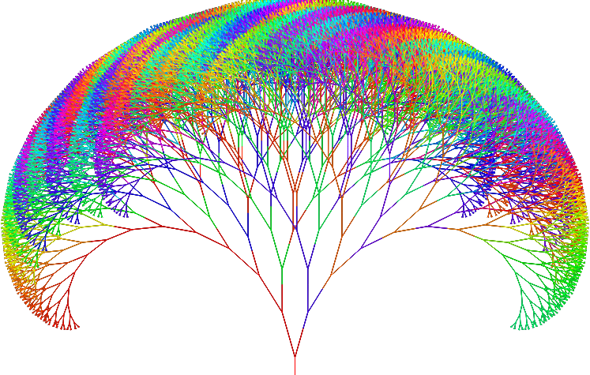
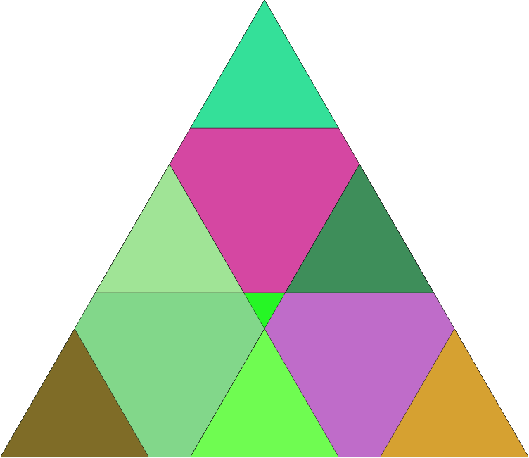

# Экспериметы с фракталами

## dragon.html
<p align="center">
    
    
</p>
Кнопки +/- рисуют следующую итерацию, браузер может сильно тормозить, по причине большого количества вычислений

Кнопка "С" - включает цветовой режим

Для того, чтобы изменить скорость изменения цвета, необходимо изменить код в строке 41:
```js 
// было:
41 if (colorMode) color = getNextColor(color, .01);
// стало
41 if (colorMode) color = getNextColor(color, 1);
```

## tree.html
<p align="center">
    
    
</p>
Кнопка "С" - включает цветовой режим (для изменений, строка 77)

Для изменения формы дерева и количества итераций:
```js
// отвечает за изменение отклонения последующих веток относительно родительской
24 dAngle = 16

// отвечает за скорость уменьшения веток
25 dScale = 0.1;

// число 1.5 отвечает за начальное масштабирование элемента, 
// чем выше число, тем больше начальная ветка, тем больше итераций(!)
// последнее число 0 - угол поворота дерева
31 fractal(field.width / 2, field.height, 1.5, 0)

// переменные отвечают за размеры веток
43	let innerRadius = 15,
44		outerRadius = 40;
```

## triangle.html
<p align="center">
    
    
</p>
Кнопка "С" - включает цветовой режим.

# !!! ВНИМАНИЕ !!!

- цветовой режим для треугольника основан на генерации случаных чисел!
- смена цветовой палитры происходит очень быстро!!
- не рекомендуется к включению для людей, имеющих проблемы с психическими расстройствами!!!